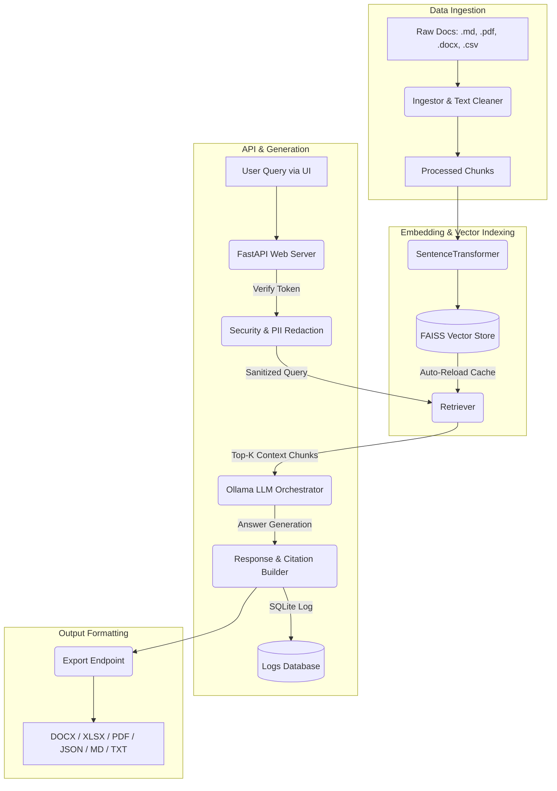

# 🧠 AI Knowledge Assistant (v2.0.0)

A production-grade, local RAG-based knowledge assistant built with a **FastAPI** backend, a **Next.js** frontend, **Ollama** for local LLM orchestration, and **FAISS** for vector retrieval. 

This repository implements a complete pipeline for document ingestion, processing, embedding, semantic search, generative answering, security compliance (PII redaction), query metrics tracking, evaluation, and structured exporting.

---

## 🏗️ Architecture Overview

The system operates entirely offline, ensuring data privacy and zero API costs. Below is the system flow showing how raw files are ingested, indexed, retrieved, and sent to the local LLM.



### Visual Schematic Diagrams

#### 1. RAG Data Flow Pipeline


#### 2. Frontend-Backend Application Design


---

## 🛠️ Technical Foundations & Cloud Mapping

Everything runs locally using open-source tools. The technologies are selected to mirror how the architecture would scale in Azure or AWS.

| Layer | Suggested Local / Open Source Tools | Cloud Equivalent (Azure / AWS) |
| :--- | :--- | :--- |
| **LLM / Chat** | Ollama (Llama 3.1+, Qwen 2.5, Mistral, Mixtral) | Azure OpenAI / AWS Bedrock |
| **Embeddings** | Sentence-Transformers (`BAAI/bge-small-en-v1.5`, MiniLM) | Azure Cognitive Search Embeddings / AWS Titan |
| **Vector DB** | FAISS / Chroma (with HNSW index where supported) | Azure AI Search (Cognitive Search) / AWS Kendra |
| **API Server** | FastAPI / Express | Azure Functions / AWS Lambda |
| **Frontend UI** | Next.js / Streamlit | Azure App Service / AWS CloudFront + S3 |
| **Parsing** | PyMuPDF, docx2txt, pandas, unstructured | Azure Form Recognizer / AWS Textract |
| **Storage** | SQLite / PostgreSQL | Azure SQL Database / AWS RDS or S3 |
| **Exports** | python-docx, openpyxl | OpenXML |
| **Monitoring & Logs** | SQLite logs, Matplotlib charts, JSON trace logs | Azure Application Insights / AWS CloudWatch |

---

## 🎯 Success Criteria & Expected Outcomes

By completing and reviewing this project, you should be able to:
*   **Explain RAG Pipelines:** Understand data flow from raw documents, processing, embedding creation, similarity retrieval, prompt packaging, and generation.
*   **Run & Extend Locally:** Maintain, deploy, and scale a functional local-first artificial intelligence solution on developer workstations.
*   **Cloud Architecture Alignment:** Architect projects using local paradigms that map cleanly to cloud native services (AWS/Azure).
*   **Demonstrate Key Skills:** Apply practical skills in vector databases, parsing documents, handling exports, and building evaluation sets.

---

## ⚡ Key Features

*   **⚡ Multi-Format Document Ingestion:** Built-in extraction parser supports Markdown (`.md`), PDF (`.pdf`), MS Word (`.docx`), and CSV (`.csv`) formats. Custom logic cleans up styling syntax, normalizes layout anomalies, and splits documents into configurable overlapping chunks.
*   **📂 Incremental Vector Storage:** Encodes text using the high-performance sentence embedding model `BAAI/bge-small-en-v1.5`. The FAISS index supports incremental updates (`--update` mode) and maintains a file registry to avoid redundant vector computation.
*   **🔄 Auto-Reloading Retriever Cache:** The retriever automatically detects file modifications (`mtime`) in the vector database and reloads the indexes on-the-fly, avoiding API restarts after background indexing completes.
*   **🔒 Security & PII Redaction:** Sanitizes queries by matching patterns for email, telephone numbers (US, India, UK), credit cards, IP addresses, US SSNs, and passport numbers. PII is redacted from questions prior to database logging. Contains token authentication and ethical usage checks.
*   **📊 Local Evaluation & Monitoring:** Logs system metrics to SQLite. Metrics calculated per request include:
    *   **Recall@K:** Percentage of retrieved chunks with a similarity score exceeding the relevance boundary (`>= 0.55`).
    *   **Citation Coverage:** Ratio of retrieved passages actually cited (`[Source N]`) in the generated answer.
    *   **Grounding Score:** Word overlap between the generated answer and retrieved context to measure grounding.
    *   **Matplotlib Dashboard:** Visualizes latency, recall over time, grounding, and citation coverage.
*   **📥 Premium Export Formats:** Supports downloading generated answers in 6 formats:
    *   `docx`: Styled Word documents using custom spacing and layouts.
    *   `xlsx`: Formatted Excel tables with color-coded headers and auto-wrapped text.
    *   `pdf`: ReportLab generated PDFs, featuring rendering of tables, text structures, and metadata footers.
    *   `json`, `md`, `txt`: Standard raw developer exports.

---

## 📁 Repository Structure

```text
ai-knowledge-assistant/
├── api/
│   └── main.py                 # FastAPI Application Entrypoint
├── core/
│   ├── embedder.py             # Vector Indexer (Full / Incremental updates)
│   ├── generator.py            # RAG Answer Generator & API Endpoints
│   ├── ingestor.py             # Document Ingestion & Chunking Parser
│   ├── logger.py               # SQLite Log Management & Metric Computation
│   ├── retriever.py            # FAISS Vector Retrieval and Cache Management
│   └── security.py             # API Token Verification & PII Redactor
├── data/                       # Local Storage (Not Committed)
│   ├── raw/                    # Uploaded / Synthetic raw documents
│   ├── processed/              # Cleaned document chunks (.json)
│   ├── vector_store/           # FAISS index and metadata registry
│   └── logs.db                 # SQLite query and evaluation database
├── tools/
│   ├── synth_data.py           # Generates synthetic Acme Corp documents
│   ├── evaluate.py             # Evaluates retriever against test questions
│   └── benchmark.py            # Performance benchmarks (Placeholder)
├── ui/                         # Next.js Frontend Dashboard (React / Tailwind)
│   ├── app/
│   │   ├── globals.css         # Styling system
│   │   ├── layout.tsx          # Page frame
│   │   └── page.tsx            # Interactive chat, upload, & metrics workspace
│   ├── components/             # Reusable UI component modules
│   └── package.json            # Frontend Node package file
├── Makefile                    # Process automation scripts
├── requirements.txt            # Python dependencies configuration
└── .env                        # Environment configurations
```

---

## ⚙️ Environment Variables

Create a `.env` file in the project root:

```ini
# LLM & Ollama Configuration
OLLAMA_URL=http://localhost:11434
OLLAMA_MODEL=mistral
OLLAMA_KEEP_ALIVE=true

# Embedding Configuration
EMBEDDING_MODEL=BAAI/bge-small-en-v1.5

# Security Access
API_TOKEN=your-secret-token-here

# Storage Paths
SQLITE_PATH=./data/logs.db
RAW_DATA_PATH=./data/raw
PROCESSED_DATA_PATH=./data/processed

# RAG Settings
CHUNK_SIZE=750
CHUNK_OVERLAP=100
TOP_K=5
```

Create a `ui/.env.local` file under the `ui/` directory:

```ini
BACKEND_URL=http://localhost:8000
API_TOKEN=your-secret-token-here
```

---

## 🚀 Quickstart Guide

### 1. Prerequisites
Ensure you have the following installed on your machine:
*   [Python 3.10+](https://www.python.org/downloads/)
*   [Node.js 18+](https://nodejs.org/)
*   [Ollama](https://ollama.com/) installed and running locally

### 2. Download LLM Models
Start the Ollama daemon and pull the models used by the system:
```bash
ollama pull mistral:7b
ollama pull llama3.1:8b
```

### 3. Installation
Install the required Python and Node.js dependencies using the automated Makefile target:
```bash
make install
```
*This installs python requirements and runs `npm install` inside the `ui/` folder.*

### 4. Populate & Build the Vector Index
Generate mock corporate SOPs, ingest the data, and build the initial vector index:
```bash
make reindex
```
*This runs `synth_data.py`, ingests/cleans documents, and runs the full embedder sequence.*

### 5. Launch the Application
Run both the FastAPI backend and Next.js frontend concurrently:
```bash
make run
```
*This spins up the FastAPI server on `http://localhost:8000` and the web interface on `http://localhost:3000`.*

---

## 🛠️ Developer Utility Commands

The `Makefile` exposes automated tasks to simplify project execution:

| Command | Action |
| :--- | :--- |
| `make install` | Installs backend packages from `requirements.txt` and frontend modules. |
| `make run` | Starts the backend (`uvicorn`) and UI (`next dev`) concurrently. |
| `make reindex` | Re-generates mock data, runs document ingestion, and computes vector store updates. |
| `make eval` | Runs the test evaluation suite to check top-k retrieval accuracy. |

---

## 🕹️ Demo Walkthrough & Script Testing

To demonstrate the capabilities of the system without starting the web UI, you can run various pipeline scripts directly from your CLI:

### 1. Ingestion Pipeline Demo
Run the text ingestion and cleaning logic over files inside `data/raw/`:
```bash
python core/ingestor.py
```

### 2. Embeddings & Index Building Demo
Embed the processed chunks and load them into the FAISS local database:
```bash
python core/embedder.py
```
To run an incremental update indexing only newly added files:
```bash
python core/embedder.py --update
```

### 3. Local Similarity Search (Retriever) Demo
Directly search for context passages in the local database matching a natural query:
```bash
python core/retriever.py "How do I report a security vulnerability?"
```

### 4. Local RAG Generation Demo
Call the Ollama model directly to answer questions based strictly on retrieved context documents, printing structured citations:
```bash
python core/generator.py "How do I report a security vulnerability?"
```

### 5. PII Redaction Demo
Verify the pattern matcher and redactor rules used for privacy:
```bash
python core/security.py
```

---

## 🖥️ Web Interface Walkthrough

The Next.js web application provides an interactive dashboard to operate the knowledge assistant. Here is how the interface features map to the RAG backend:

1. **Interactive Chat Console:** Type natural language queries. The interface displays answers generated by the local Ollama LLM.
2. **Expandable Citations Panel:** Click on citation badges (e.g. `[Source N]`) next to or below each answer to expand the **Citation Card**, revealing:
   - File origin (e.g., `sop_incident_response.md`)
   - Relevance Confidence (`High`, `Medium`, or `Low`)
   - Similarity retrieval score
   - Extracted text passage snippet
3. **Structured Document Exports:** After receiving an answer, use the quick-export action buttons to download it as:
   - **Word Document (`.docx`):** A professionally formatted report containing the question, answer, and bullets of cited sources.
   - **Excel Spreadsheet (`.xlsx`):** A worksheet featuring auto-wrapped text cells and a color-coded sources table.
   - **Portable Document Format (`.pdf`):** A custom PDF layout with data tables.
4. **Interactive Document Uploader:** Drag-and-drop or select new documents (`.md`, `.pdf`, `.docx`, `.csv`) from the UI. Uploaded files are sent to the backend `/upload` route and safely written to `data/raw/` with automatic collision-renaming.
5. **On-Demand Index Builder:** Trigger reindexing directly from the UI settings. This makes an API call to `/reindex` which ingests, chunks, and updates the FAISS vector database without requiring server restart.
6. **Telemetry & Query Logs Portal:** Opens a modal visualizing current query performance metrics (average response time, grounding percentage, and recall scores) alongside historical SQLite logs.

---

## 📊 Evaluation & Verification

To verify the system performance, evaluate the retriever against the mock questions stored in the database:
```bash
make eval
```

This runs `tools/evaluate.py`, comparing top search results against expected ground-truth sources. When finished, it outputs a summary containing the accuracy percentage and aggregate query scores.

To generate a performance dashboard chart (`data/eval_dashboard.png`), execute:
```bash
python core/logger.py
```
*This aggregates the sqlite logging entries and generates Matplotlib curves demonstrating Latency over time, Recall@k over time, and Grounding and Citation coverage distributions.*

---

## 🔌 API Endpoints Summary

All backend communication passes through the FastAPI application running on `http://localhost:8000`.

### 1. Root Status
*   **Endpoint:** `GET /`
*   **Headers:** None
*   **Response:**
    ```json
    {"status": "ok", "message": "AI Knowledge Assistant is running"}
    ```

### 2. Query Agent (RAG)
*   **Endpoint:** `POST /ask`
*   **Headers:** `Authorization: Bearer <API_TOKEN>`
*   **Request Payload:**
    ```json
    {
      "question": "How do I report a security vulnerability?",
      "top_k": 5
    }
    ```
*   **Response Payload:** Returns the text answer and citations containing source snippets, matching relevance scores, and confidence classifications.

### 3. File Upload
*   **Endpoint:** `POST /upload`
*   **Headers:** `Authorization: Bearer <API_TOKEN>`
*   **Request Payload:** Multipart Form Data (`file`)
*   **Response Payload:** Upload completion status and final filename (renamed if name collides).

### 4. Vector Reindexing
*   **Endpoint:** `POST /reindex`
*   **Headers:** `Authorization: Bearer <API_TOKEN>`
*   **Request Payload:**
    ```json
    {
      "mode": "update"
    }
    ```
    *(Set `mode` to `full` to clear database and force rebuild; defaults to `update` for incremental ingestion).*

### 5. Document Exporter
*   **Endpoint:** `POST /export`
*   **Headers:** `Authorization: Bearer <API_TOKEN>`
*   **Request Payload:** Pass format extension (`pdf`, `docx`, `xlsx`, `json`, `md`, `txt`) alongside the question, answer context, and citation list.
*   **Response:** File download attachment stream.

### 6. Aggregated Metrics
*   **Endpoint:** `GET /metrics`
*   **Headers:** None
*   **Response:** Provides aggregate statistics (avg latency, avg grounding score, total queries count) and a list of the 10 most recent query logs.

---

## 🚀 Future Enhancements

The following features are planned for future releases (derived from optional project extensions):
1.  **🔍 Hybrid Retrieval:** Combine semantic vector search (FAISS) with lexical keyword-based search (e.g. BM25) to improve query coverage.
2.  **📈 Local Reranking Models:** Integrate a cross-encoder model (such as `ms-marco-MiniLM-L-6-v2`) to perform post-retrieval reranking and boost precision.
3.  **📊 Custom Dashboards:** Enhance UI telemetry with time-series charts illustrating query distribution, database hit rates, and metrics trend analysis.
4.  **🤖 Agentic Tool Calling:** Give the LLM capability to dynamically run tool triggers (e.g. reindexing files, triggering exports, or calling external APIs) based on chat input.
5.  **🐳 Containerization:** Dockerize the entire project with `docker-compose` to package backend, frontend, database, and Ollama in a single file-system build.

---

## ✍️ Author

*   **Ayan Banerjee** - [@ayanbanerjee-png](https://github.com/ayanbanerjee-png)
*   **Project Repository:** [AI-KNOWLEDGE-ASSISTANT](https://github.com/ayanbanerjee-png/AI-KNOWLEDGE-ASSISTANT.git)
